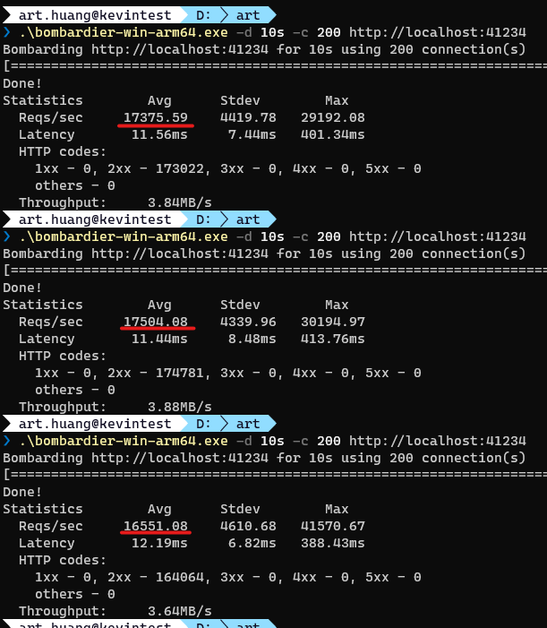
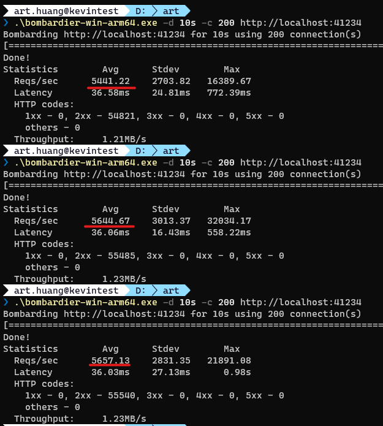

# intro

this is a test project for practice .net core 6, middleware and docker build

```
dotnet run
```

# QPS Tool

[bombardier](https://github.com/codesenberg/bombardier)

## 測試主機硬體規格

- CPU: Intel i7-7600U 2.8GHz
- RAM: 16GB
- OS: Win10 21H1
- Docker Engine: v20.10.7

## 測試結果

| 物理主機作業系統 | type                      | QPS      |
| ---------------- | ------------------------- | -------- |
| Windows          | IIS + Kestrel             | 10441.49 |
| Windows          | Kestrel                   | 46156.68 |
| Windows          | Windows Container Kestrel | 17143.58 |
| Windows          | Linux Container Kestrel   | 5581     |
| Windows          | WSL2 Kestrel              | 17314.61 |

# docker build

## Windows Container

測試主機為 Windows OS 掛 windows container

```bash
docker build -t mvc6 .
docker run -d --name=m6 --rm -p 41234:80 mvc6
```



## Linux Container

測試主機為 Windows OS 掛 linux container , 實際若要測試 linux 的佈署環境效能，應該還是要用真的 linux OS 去掛 container 進行測試

```bash
docker build -f build/build-image.kestrel.dockerfile -t mvc6 --build-arg project_name=WebApplication1 .
docker run -d --name=m6 --rm -p 41234:80 mvc6
```


